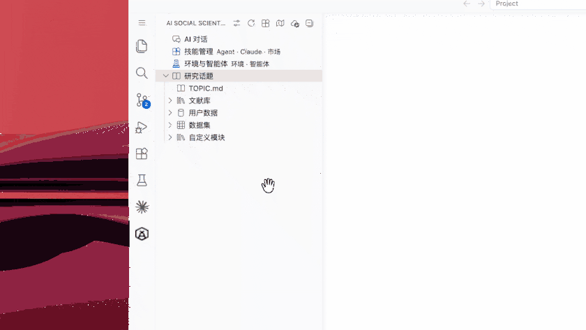

# AI Social Scientist

[](https://code.visualstudio.com/)
[](LICENSE)
[](package.json)

VS Code / Cursor 扩展：面向社会科学研究的 LLM 工作台，对接 [AgentSociety2](https://github.com/tsinghua-fib-lab/agentsociety) 模拟框架，并统一管理 Claude Code / Codex 的本地路由与供应商。

## AI Social Scientist 研究闭环

AI Social Scientist 将社会科学研究组织成七个可检查、可回退的阶段：研究范围界定、假设生成、实验设计、仿真配置、运行执行、结果分析与论文草拟。


图片未加载时可[单独查看七阶段架构图](resources/walkthrough/images/ai-social-scientist-workflow.png)。

## 效果展示

### 启动 AI Social Scientist

从侧边栏进入 AI Chat，直接询问研究能力；AI Social Scientist 会说明文献检索、假设设计、实验配置与运行、分析和论文写作等可执行阶段，并继续围绕 `TOPIC.md` 与工作区产物推进任务。



[单独打开主演示动图](resources/readme/ai-social-scientist.gif)

### 更多演示

为避免 Marketplace 首页同时加载多张 GIF，下面的辅助演示按需打开：

| 场景 | 展示内容 | 动图 |
|------|----------|------|
| **创建可执行研究工作区** | 从新建目录生成研究主题、文献、数据、假设、实验与分析目录 | [查看工作区初始化演示](resources/readme/research-workspace.gif) |
| **官方登录与第三方 Gateway** | 管理官方 Claude / Codex 登录、第三方 API 直连与本地 Gateway 路由 | [查看供应商路由演示](resources/readme/provider-routing.gif) |

## 功能概览

- **研究工作区**：项目树、文献索引、假设与实验目录、技能市场
- **配置向导**：仿真 LLM、工作区 `.env`、后端、文献 MCP、CLI 网关
- **本地 AI Gateway**：Anthropic Messages / OpenAI Chat / Responses 协议转换、用量统计、故障转移、请求整流
- **Claude Code / Codex**：共享供应商池；官方订阅保持 CLI 登录直连；Codex 模型目录自动写入 `~/.codex/agentsociety-model-catalog.json`
- **回放与分析**：实验回放 Webview、分析 harness 状态

## 安装

### 从 GitHub Release（推荐）

发版标签 `agentsociety2-v*` 的 [GitHub Release](https://github.com/tsinghua-fib-lab/agentsociety/releases) 会附带 `ai-social-scientist.vsix`：

```bash
code --install-extension ai-social-scientist.vsix
# 或 Cursor / code-server：Extensions → Install from VSIX…
```

Cursor / VS Code Remote（含 **Coder**）请将扩展安装到 **Workspace（远程）** 侧，以便读取远程环境中的 `~/.codex/auth.json` 与 CLI 配置。本扩展声明 `extensionKind: workspace`。

同一机器上只保留一个版本。若升级后侧边栏仍异常，先删除旧目录再强制安装：

```bash
rm -rf ~/.local/share/code-server/extensions/tsinghua-fib-lab.ai-social-scientist-1.6.*
code-server --install-extension ai-social-scientist.vsix --force
```

然后执行 **Developer: Reload Window**。

### 本地打包

```bash
cd extension
npm ci
npm run package:check    # lint + 单测 + 构建 + 打 VSIX
code --install-extension ai-social-scientist.vsix
```

仅打包（跳过检查）：`npm run package`。

### 开发调试

```bash
cd extension
npm ci
npm run build            # 或 npm run dev（watch）
```

在 VS Code 中打开 `extension` 目录，按 `F5` 启动 Extension Development Host。

## 快速开始

1. **打开工作区文件夹**（不要只打开单个文件；Coder 上请打开项目根目录，而不是整个 `$HOME`）
2. 命令面板运行 **「AI Social Scientist: 打开配置」**
3. 按向导完成：仿真 LLM → 保存 `.env` → 启动后端 →（可选）文献 / CLI 网关
4. 也可运行 **「AI Social Scientist: 打开快速入门」** 查看 Walkthrough（标题与正文随 VS Code 语言切换）

### 前置要求

| 依赖             | 版本                            |
| ---------------- | ------------------------------- |
| Node.js          | ^22.13.0 或 >=24（见 `.nvmrc`） |
| Python           | >= 3.11                         |
| uv               | 推荐（AgentSociety2）           |
| VS Code / Cursor | >= 1.95.0                       |

### 工作区 `.env`（常见项）

| 变量                                                                                | 说明                                                        |
| ----------------------------------------------------------------------------------- | ----------------------------------------------------------- |
| `AGENTSOCIETY_LLM_API_KEY` / `AGENTSOCIETY_LLM_API_BASE` / `AGENTSOCIETY_LLM_MODEL` | 仿真默认 LLM                                                |
| `LITERATURE_SEARCH_API_KEY`                                                         | 文献 MCP（可选）                                            |
| `PYTHON_PATH`                                                                       | Python 解释器（可自动检测；Coder 上建议显式设置以加快激活） |
| `BACKEND_PORT`                                                                      | 本地后端端口                                                |

Claude / Codex 的供应商与 API Key 保存在扩展全局状态与 SecretStorage，不写入工作区 `.env`。

## CLI 网关（Claude / Codex）

配置页 **Claude / Codex** 区域：

1. **选择连接方式**：官方账号、第三方 API 直连，或第三方 API 经本地 Gateway
2. **添加供应商**：填写 Base URL + API Key，指定 Claude / Codex 用途；检测后自动识别协议
3. **按需开启 Gateway**：用于协议转换、用量统计、故障转移与请求整流；官方模式保持本地路由关闭
4. **同步 Codex 配置**：扩展只改写自己管理的 `config.toml` 路由字段和模型目录，不覆盖 `auth.json` 或系统凭据库中的官方登录
5. **重启 CLI**：供应商、模型目录或出站代理变化后，用页内「重启」按钮刷新终端会话

Gateway 关闭或扩展卸载时会恢复可用的直连配置；若路由状态仍为开启，下次扩展激活会自动启动 Gateway 并重新应用本地路由。网关覆盖 Anthropic Messages、OpenAI Chat Completions、OpenAI Responses；详情见配置页「格式转换」提示。

## 开发命令

| 场景                 | 命令                    |
| -------------------- | ----------------------- |
| 安装依赖             | `npm ci`                |
| 检查（lint+测+构建） | `npm run check`         |
| 生产构建             | `npm run build`         |
| 开发 watch           | `npm run dev`           |
| 清理重建             | `npm run rebuild`       |
| 打包 VSIX            | `npm run package`       |
| 检查后打包           | `npm run package:check` |
| Lint                 | `npm run lint`          |
| 网关 / Codex 单测    | `npm run test:gateway`  |

更完整的模块说明见 [开发指南](docs/DEVELOPMENT.md)。发版与变更记录见 [CHANGELOG](CHANGELOG.md)。

## 故障排除

| 现象                                                   | 处理                                                                                                                            |
| ------------------------------------------------------ | ------------------------------------------------------------------------------------------------------------------------------- |
| 侧边栏 `no data provider` / 扩展一直 **Activating...** | 确认已打开**文件夹**；删除重复旧版扩展后 Reload；在 `.env` 设置 `PYTHON_PATH` 避免激活时阻塞式 Python 探测                      |
| Codex catalog 仍是旧格式（含 `built by OpenAI`）       | 扩展激活后，在配置页点 **Codex「刷新配置」**；或确认 `~/.codex/agentsociety-model-catalog.json` 含 `supported_reasoning_levels` |
| Codex 官方登录检测不到                                 | 扩展须运行在远程工作区；配置页「检测路径」应指向当前环境的 `~/.codex/auth.json`                                                 |
| 后端连不上                                             | 检查状态栏 Backend、工作区 `.env` 的 `BACKEND_HOST` / `BACKEND_PORT`，或「查看日志」                                            |
| Extension Development Host 读错 `.env`                 | 确认调试窗口打开的是正确工作区根目录                                                                                            |

## 相关链接

- [AgentSociety 仓库](https://github.com/tsinghua-fib-lab/agentsociety)
- [问题反馈](https://github.com/tsinghua-fib-lab/agentsociety/issues)
- [变更记录](CHANGELOG.md)
- [开发指南](docs/DEVELOPMENT.md)
- [贡献指南](https://github.com/tsinghua-fib-lab/agentsociety/blob/main/CONTRIBUTING.md)
- [用户文档（agentsociety2）](https://agentsociety2.readthedocs.io/)

## 许可证

本扩展与 AgentSociety 主仓库一致，采用 [Apache License 2.0](LICENSE)。
