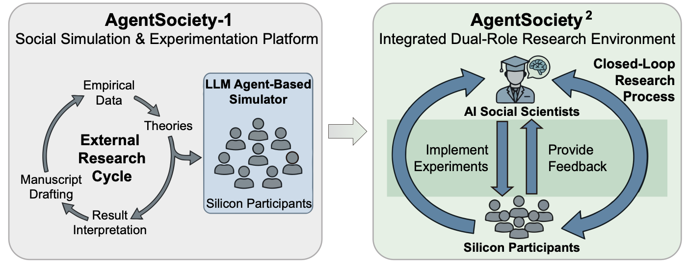
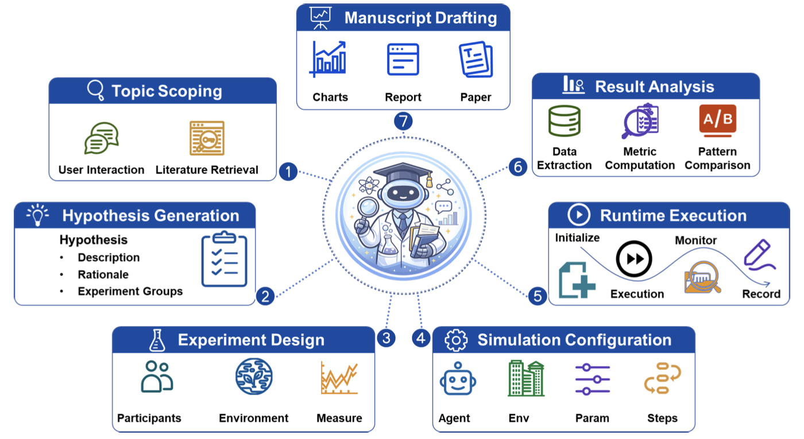

## Welcome to AI Social Scientist

**AgentSociety²** is more than a multi-agent simulator. It is an Integrated Research Environment (IRE) for executable social science: research questions, theories, silicon participants, environments, interventions, measurements, and claims live in one inspectable, revisable, and reproducible workspace.

*Figure: AgentSociety² couples AI Social Scientists and Silicon Participants in one closed loop. Original figure from the [AgentSociety 2 paper](https://arxiv.org/abs/2607.11895).*

### Three collaborating roles

| Role | Responsibility |
|------|----------------|
| **Human researcher** | Frames the question and judges key transitions such as hypotheses, interventions, validity, and claim release |
| **AI Social Scientist** | Coordinates literature, hypotheses, experiment design, simulation, analysis, and manuscript drafting |
| **Silicon Participants** | Perceive, reason, and act in configurable environments to produce measurable behavioral feedback |

### The AI Social Scientist in seven stages

The AI Social Scientist is the research-orchestration role at the center of the IRE. Its seven-stage workflow keeps each transition visible: topic scoping, hypothesis generation, experiment design, simulation configuration, runtime execution, result analysis, and manuscript drafting.

*Figure: the seven AI Social Scientist stages from the [AgentSociety 2 paper](https://arxiv.org/abs/2607.11895).*

“Executable” matters: an idea does not remain only in chat. It becomes inspectable artifacts such as `TOPIC.md`, hypothesis packages, experiment configs, run records, analysis reports, and manuscript material. You can review intermediate outputs, change parameters, revisit stages, and rerun the study.

### What you can do

| Stage | Workspace capability |
|-------|----------------------|
| Literature & question | Maintain `TOPIC.md`, a literature library, and data assets |
| Hypothesis & design | Form testable hypotheses, groups, interventions, and measures |
| Social simulation | Configure agents, environments, and steps for multi-scale experiments |
| Analysis & writing | Inspect runs, replay, charts, reports, and manuscript material |
| Extension | Install research skills, agent runtime skills, and Claude/Codex skills |

### Fastest path

1. **Enter the workspace**: trust the folder and change the display language if needed.
2. **Learn the layout**: find the project tree, editor, AI Chat, and status bar.
3. **Initialize a project**: create the research structure and `TOPIC.md`.
4. **Configure the runtime**: set the simulation LLM, validate it, and start the backend.
5. **Run a research loop**: begin with a concrete question and ask the AI Social Scientist for the next reviewable artifact.

The following steps follow this path. Use the glossary appendix whenever a term is unfamiliar.
