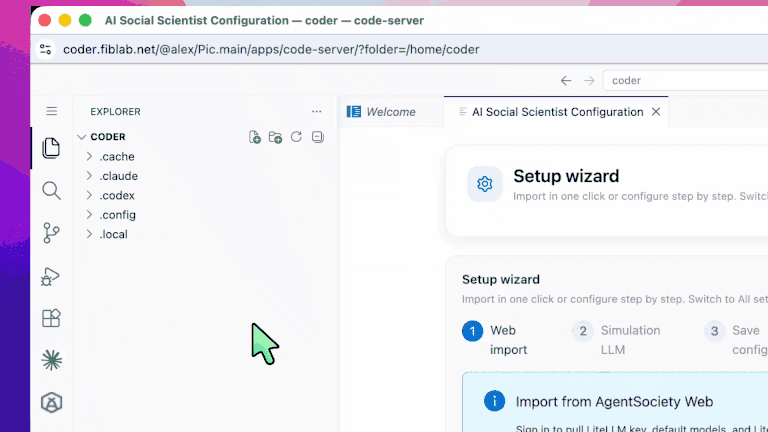

## Initialize a Research Project

You need a research workspace folder before you start.

### Create a folder

If you do not have a project yet, create an empty folder and open it in VS Code / code-server:



### Initialize the layout

With a workspace open, run **Initialize Research Project**. The longer demos are hosted on GitHub to keep the installed extension small:

1. [Initialize the workspace and wait](https://github.com/tsinghua-fib-lab/agentsociety/blob/main/extension/resources/walkthrough/images/gif/init-01-workspace.gif)
2. [Optional one-click import and confirmation](https://github.com/tsinghua-fib-lab/agentsociety/blob/main/extension/resources/walkthrough/images/gif/init-02-web-import.gif)
3. [Simulation LLM and following wizard steps](https://github.com/tsinghua-fib-lab/agentsociety/blob/main/extension/resources/walkthrough/images/gif/init-03-llm-wizard.gif)
4. [CLI Gateway and finish](https://github.com/tsinghua-fib-lab/agentsociety/blob/main/extension/resources/walkthrough/images/gif/init-04-cli-finish.gif)

The extension creates the base layout and writes `TOPIC.md`, a `.env` template, and related files:

```text
workspace-root/
├── TOPIC.md
├── .env
├── papers/
├── datasets/
├── user_data/
├── custom/
├── .claude/skills/
├── hypothesis_<id>/     # created by later workflows
├── analysis/            # created when using analysis skills
└── paper/               # created when using paper-toolkit
```

You can also open an existing research workspace; the extension recognizes the layout.

### Command Palette

- `Ctrl+Shift+P` (Mac: `Cmd+Shift+P`)
- Type `AI Social Scientist` to list extension commands

[Initialize Project](command:aiSocialScientist.initProject)
