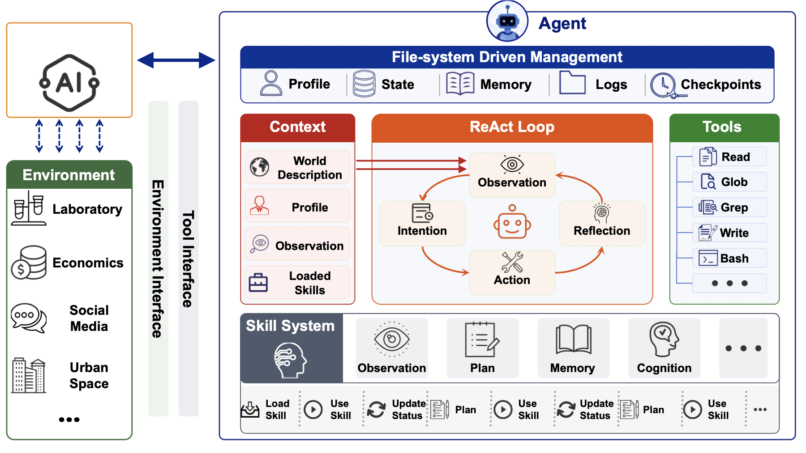
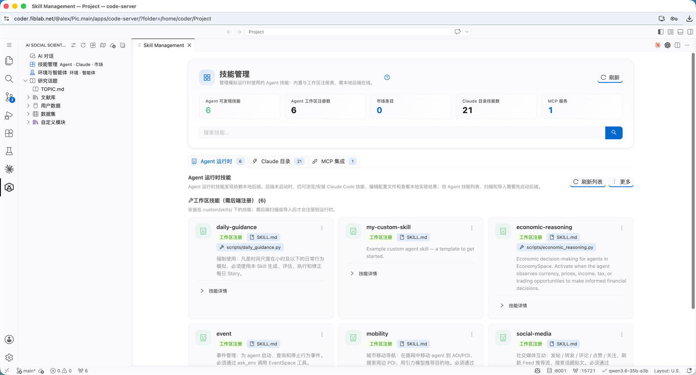
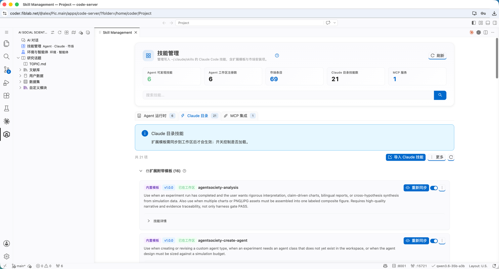

## Extend Research with Skills

AgentSociety² packages reusable methods, tools, and behavioral procedures as skills. The AI Social Scientist progressively loads research skills for the current task, while Silicon Participants activate behavioral skills during simulation. This avoids one oversized prompt and makes the capabilities used at each step easier to audit.

Open skill management from the sidebar **Skills** button or the Command Palette. The page has three tabs; details live behind **?** icons and the page help.

### PersonAgent as a Silicon Participant

`PersonAgent` is the built-in, profile-based Silicon Participant. It uses the paper's workspace-backed Social Generative Agent architecture: profile, state, memory, logs, and checkpoints remain inspectable; a ReAct loop connects observation, intention, action, and reflection; tools and skills are loaded as needed for the current environment and experiment.

*Figure: Social Generative Agent architecture from the [AgentSociety 2 paper](https://arxiv.org/abs/2607.11895). `PersonAgent` is the built-in profile-based implementation on this runtime.*

### Agent runtime

The **Agent runtime** tab manages workspace skills used by simulation agents (`custom/skills/`, usually registered with the backend):

Examples include `daily-guidance`, economic reasoning, events, mobility, and social media. These skills change **how simulated participants behave**.

### Claude catalog

The **Claude catalog** tab manages skill templates for Claude Code / Codex (synced to `.claude/skills/`):

Bundled templates can be toggled or re-synced; you can also import external Claude skills. This layer primarily drives research workflows such as literature review, hypothesis management, experiment configuration, execution, and analysis.

### Comparison

| Type | Location | Used by |
|------|----------|---------|
| **Agent runtime** | `custom/skills/` | Behavioral capabilities of Silicon Participants |
| **Claude / Codex catalog** | `.claude/skills/` | Research and engineering capabilities of the AI Social Scientist |

### MCP

Configure literature MCP under **Config → Literature MCP**, then sync it from **Skill management → MCP integration** to Claude / Codex. MCP supplies external tools and data; a Skill specifies when to call them, how to verify results, and what artifact to produce.

[Open Skill Management](command:aiSocialScientist.openSkillMarketplace)
