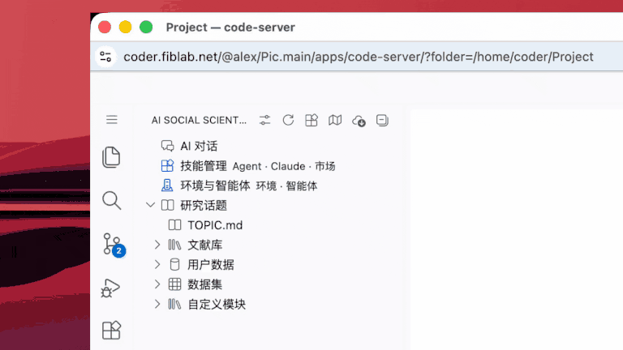
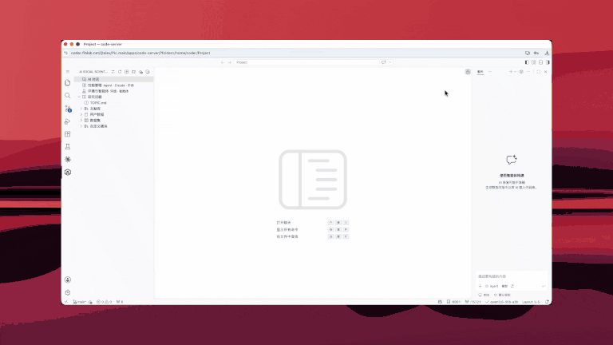

## Start Research with the AI Social Scientist

AI Chat is the collaboration surface; the research itself lives in workspace artifacts and executable experiments. AgentSociety² organizes the process into seven inspectable and revisable stages:

*Figure: from topic scoping, hypothesis generation, experiment design, and simulation configuration to execution, analysis, and manuscript drafting. Original figure from the [AgentSociety 2 paper](https://arxiv.org/abs/2607.11895).*

### A good first request

Start with a concrete research question and a concrete deliverable. For example:

> Read `TOPIC.md`. For the question “Do recommender systems intensify opinion polarization?”, review relevant literature and first summarize mechanisms, measurable variables, and two candidate hypotheses. Save the result in the workspace, but do not run an experiment until I review it.

This keeps consequential judgment with the researcher and makes the next artifact easy to inspect. A useful rhythm is:

1. **Scope the question**: define the population, context, and causal or mechanistic problem.
2. **Ground hypotheses**: require evidence, theoretical rationale, and falsifiable predictions.
3. **Review the design**: inspect participants, environment, intervention, controls, and measures.
4. **Configure and execute**: approve the config before running; retain logs and snapshots.
5. **Analyze and write**: separate reproduced patterns, deviations, limitations, and supported claims.

### Open AI Chat

Open the right-side **Chat** panel, choose an agent/model, and describe the task:

You can also enter from **AI Chat** in the sidebar, the title-bar chat control, or the Command Palette:

[Open AI Chat](command:aiSocialScientist.openChat)

> The AI Social Scientist reduces orchestration overhead; it does not replace scientific judgment. Review hypotheses, operationalization, interventions, analysis, and evidence boundaries before releasing claims.
