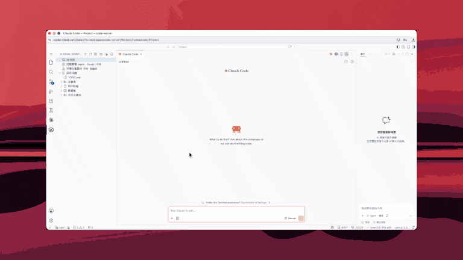

## Claude Code and Codex

**Claude Code** and **Codex** are terminal/editor collaboration surfaces for the AI Social Scientist. After project initialization, the workspace includes:

```text
workspace-root/
├── .claude/skills/   # developer skills
├── CLAUDE.md
└── AGENTS.md
```

### Choose a connection mode

| Mode | Recommended configuration |
|------|---------------------------|
| **Official Claude / Codex account** | Keep the corresponding local proxy switch off and sign in from the CLI |
| **Direct third-party API** | Add an API-key provider on the config page and make it the default for that assistant |
| **Third-party API through Gateway** | Add the provider, then enable Claude/Codex routing for protocol translation, failover, and usage accounting |

Official sign-in and third-party provider settings can coexist. Codex keeps credentials in `auth.json` or the OS credential store, while provider routing lives in `config.toml`; AgentSociety changes only its owned routing fields and does not overwrite the official login cache.

### Codex switching and restart behavior

- **Switch to official:** Codex Gateway routing turns off and AgentSociety-owned provider fields are removed. Existing official credentials remain available.
- **Enable Gateway routing:** the live `config.toml` points Codex to the local Gateway; a protected restore snapshot tracks the direct provider configuration.
- **Switch providers while routed:** the local route stays active and the restore target follows the newly selected provider.
- **Disable routing or unload the extension:** a usable direct configuration is restored. If routing was still enabled, the next extension activation starts the Gateway and reapplies the local route.
- **Gateway startup failure:** Codex falls back to the direct configuration instead of being left on an unavailable localhost endpoint.

Codex loads provider and model-catalog settings at startup. Restart Codex from the config page after changing the provider, model, catalog, or outbound proxy. Restarting the AgentSociety backend is only needed for simulation `.env` changes.

### Recommended setup

1. **Config page** — simulation LLM, optional CLI Gateway, providers, and outbound proxy  
2. **Skill management → MCP integration** — sync literature MCP to Claude / Codex  
3. Start `claude` or `codex` in a terminal; check `/status` and `/mcp`  

[Open Config](command:aiSocialScientist.openConfigPage) · [Open Skills](command:aiSocialScientist.openSkillMarketplace) · [Claude skill sources](command:aiSocialScientist.openClaudeSkillSourcesSettings)

### Bypass permission mode (advanced)

In a trusted workspace, Claude Code can use **bypassPermissions** to reduce repeated confirmations:



> ⚠️ Bypass skips some tool-call confirmations. Use it only for projects you fully trust. It is separate from VS Code Workspace Trust and should not be enabled for unfamiliar repositories.

### What else to try

| Feature | Entry |
|---------|-------|
| Simulation replay | Right-click an experiment folder |
| Paper / analysis workspace | `paper/`, `analysis/` |
| User guide | Sidebar 📖 |
| Glossary | Last step in this walkthrough |

Docs: [agentsociety2.readthedocs.io](https://agentsociety2.readthedocs.io/) · Paper: [arXiv:2607.11895](https://arxiv.org/abs/2607.11895) · Issues: [GitHub Issues](https://github.com/tsinghua-fib-lab/agentsociety/issues)
