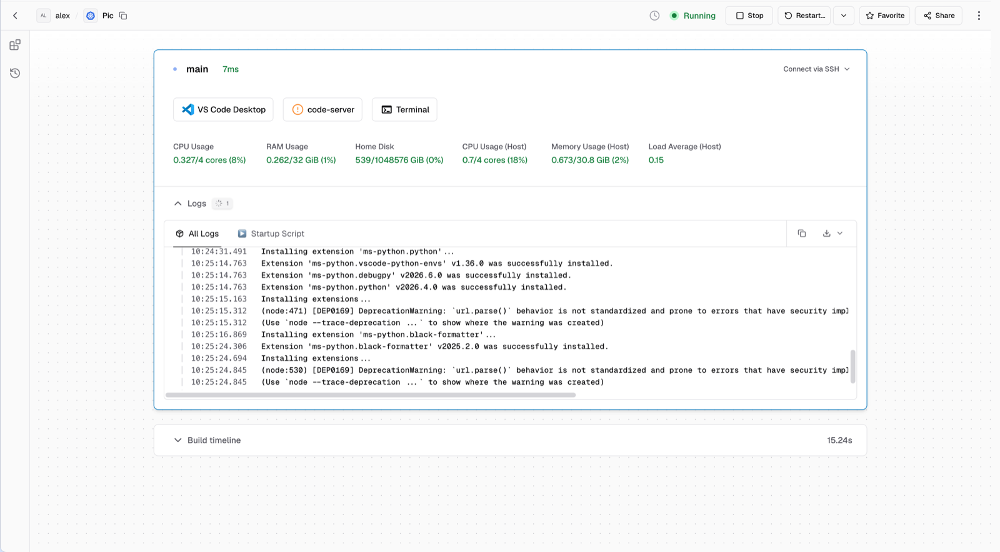
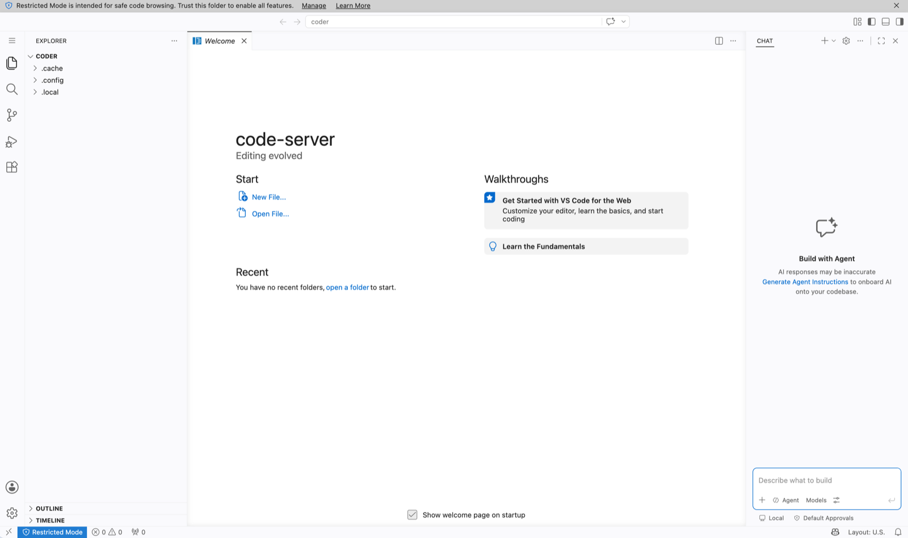
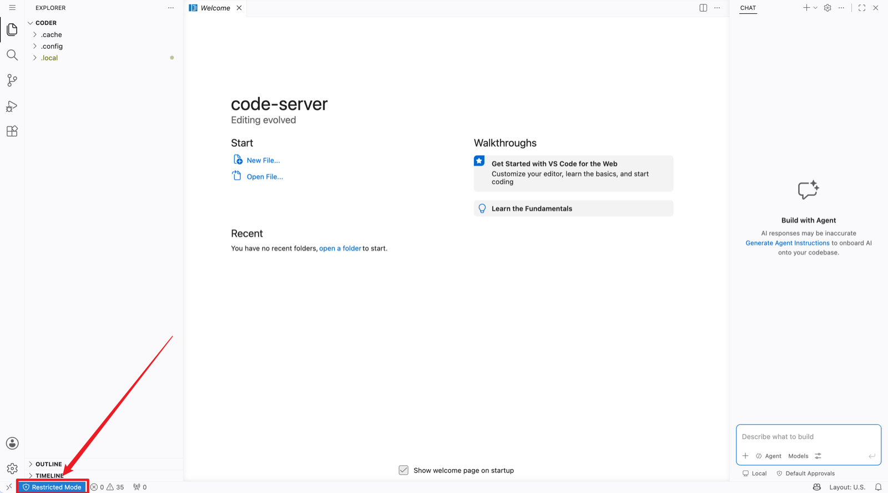
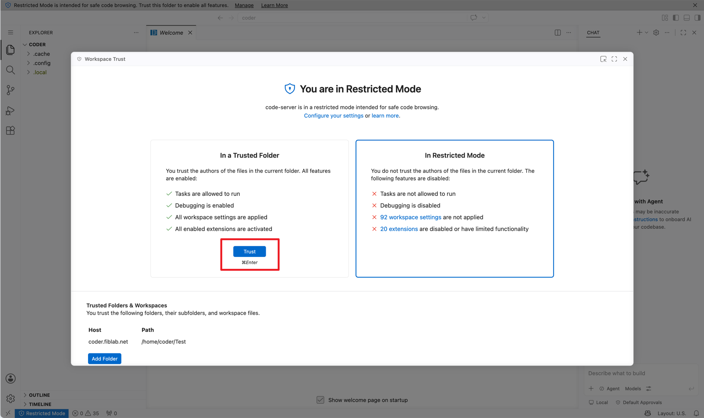
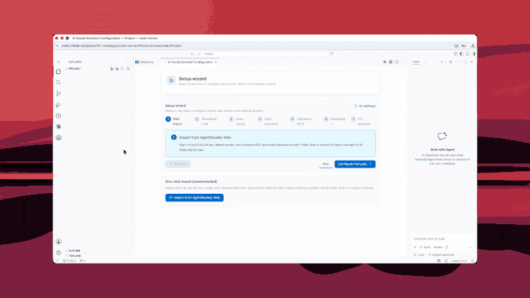

## 进入工作区

在 Coder / code-server 中，第一次打开或工作区刚重启时，按下面顺序处理即可。

### 工作区启动中

门户页若短暂报错或卡在启动日志，通常是扩展与服务还在安装，**稍等再进 IDE**：

### 初次进入

进入后常见空欢迎页与右侧 Chat 面板：

### 信任工作区

若状态栏出现 **Restricted Mode（受限模式）**，扩展与任务会受限：

打开 **Workspace Trust**，选择 **Trust** 信任当前文件夹：

### 切换中文界面（可选）

需要中文 UI 时可切换显示语言：

信任并打开文件夹后，再进入下一步认识整体界面。
