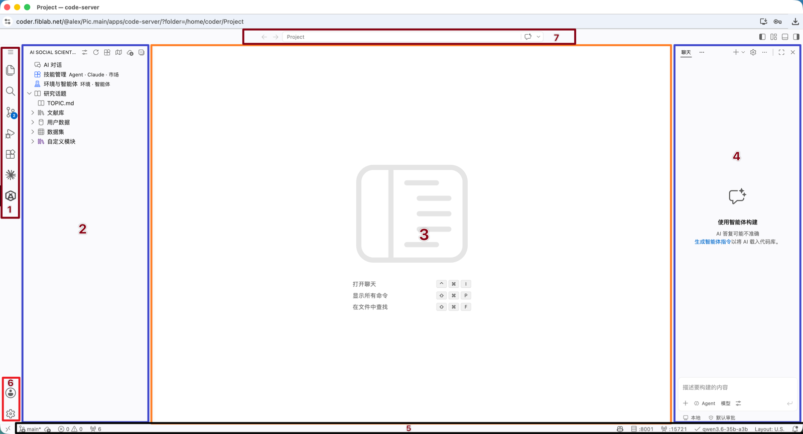

## 认识侧边栏

AI Social Scientist 的日常操作都从**左侧活动栏**开始。这里负责展示研究项目结构，也提供配置、技能市场和帮助入口。

### 如何打开

1. 找到 VS Code **左侧活动栏**（最左侧的图标列）
2. 点击 **AI Social Scientist** 图标
3. 侧边栏会显示 **Project Structure** 视图



| 编号 | 区域 | 作用 |
|------|------|------|
| 1 | 活动栏 | 切换 Explorer、搜索、Git、扩展、AI Social Scientist 等主要视图。 |
| 2 | 侧边栏 | 展示当前视图的内容，例如项目文件树或 AI Social Scientist 项目结构。 |
| 3 | 编辑区 | 打开欢迎页、配置页、实验文件、AI Chat 或回放页面。 |

> 💡 侧边栏需要打开一个工作区文件夹后才会显示项目内容。

---

### 侧边栏快捷按钮

在侧边栏顶部，你会看到四个图标按钮：

| 按钮 | 功能 | 什么时候用 |
|------|------|-----------|
| 🔄 **刷新** | 重新加载项目文件树 | 添加或删除文件后视图没更新时 |
| 🧩 **技能** | 打开技能市场 | 安装、启用或管理研究技能时 |
| ⚙️ **配置** | 打开 LLM/API 配置页面 | 首次使用或更换模型服务时 |
| 📖 **帮助** | 打开使用指南 | 需要查看完整功能说明时 |

### 项目结构视图

侧边栏会以树形结构展示你的研究项目：


```
📂 your-project/
├── 📄 TOPIC.md           → 研究话题（点击预览，右键可编辑）
├── 📂 papers/            → 文献资料
│   ├── 📂 pdf/           → PDF 原文
│   └── 📂 md/            → Markdown 笔记
├── 📂 paper/             → 论文工作区（章节、图表、表格、编译记录、审阅）
├── 📂 analysis/          → 分析工作区（假设、实验、EDA、综合归纳）
├── 📂 hypothesis_xxx/    → 研究假设
│   └── 📂 experiment_xxx/ → 实验（点击可回放）
├── 📂 custom/skills/     → 已安装的技能
└── 📂 .agentsociety/     → 分析 harness 状态（自动维护）
```

> 💡 点击文件可直接查看：JSON/YAML 可折叠树形查看、CSV 可排序搜索、Markdown 预览、HTML 报告。右键查看更多操作。

[打开侧边栏](command:projectStructureView.focus)
