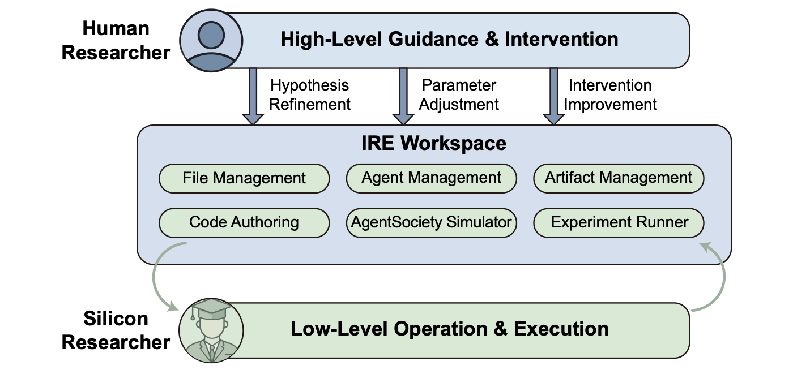

## 认识界面

点击左侧活动栏中的 **AI Social Scientist** 图标。下图红框编号与表格一一对应：


| 编号 | 名称 | 功能 |
|------|------|------|
| **1** | **活动栏** | 切换资源管理器、搜索、Git、扩展、AI Social Scientist 等视图。 |
| **2** | **AI Social Scientist 侧边栏** | 项目结构：AI 对话、技能管理（Agent / Claude / 市场）、环境与智能体、研究话题（`TOPIC.md`）、文献库、用户数据、数据集、自定义模块等。 |
| **3** | **编辑器** | 打开配置页、Markdown、实验文件、Claude Code、回放等；空闲时显示常用快捷键。 |
| **4** | **AI Chat** | 右侧对话面板：选择 Agent / 模型，描述任务并附带文件上下文。 |
| **5** | **状态栏** | Git、诊断、后端端口（如 `8001`）、当前模型；可点击管理后端与网关。 |
| **6** | **账户 / 设置** | 活动栏底部：账户同步与 VS Code 设置、快捷键、主题。 |
| **7** | **标题栏 / 面包屑** | 当前路径与布局控件；可快速打开聊天或调整面板。 |

### 人主导的研究工作区

这套界面对应论文中的 **交互式研究环境（Interactive Research Environment, IRE）**：研究者始终负责研究问题、关键假设、干预设计与结果解释等高层判断；AI Social Scientist 则在文件、智能体、研究产物、仿真与实验执行之间完成底层操作。



*概念架构改编自 [AgentSociety 2 论文](https://arxiv.org/abs/2607.11895) Figure 4。*

### 侧边栏常用按钮

| 按钮 | 功能 |
|------|------|
| 🔄 刷新 | 重新加载项目树 |
| 🧩 技能 | 打开技能管理 |
| ⚙️ 配置 | 打开 LLM / API 配置 |
| 📖 帮助 | 打开使用指南 |

### 典型目录

```
workspace-root/
├── TOPIC.md
├── papers/          # 文献
├── datasets/        # 数据集
├── user_data/       # 用户数据
├── custom/          # 自定义模块与 Agent 技能
├── .claude/skills/  # Claude / Codex 技能
├── hypothesis_*/    # 假设与实验
├── analysis/        # 分析工作区
└── paper/           # 论文工作区
```

[打开侧边栏](command:projectStructureView.focus)
